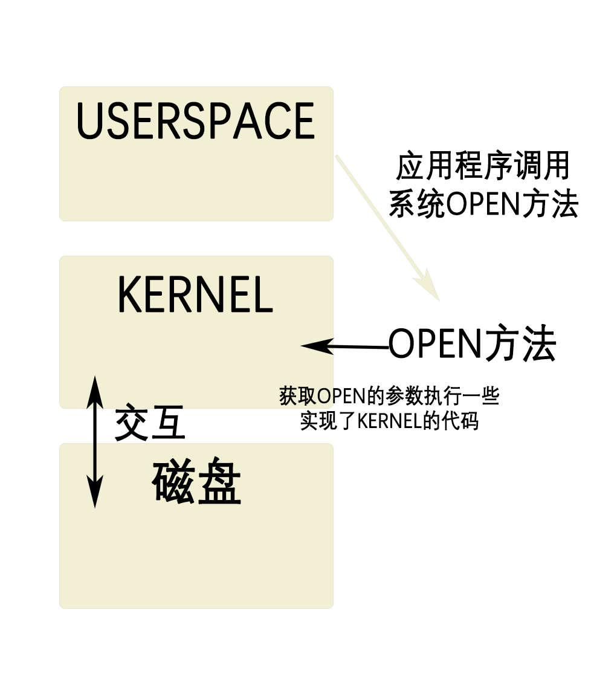
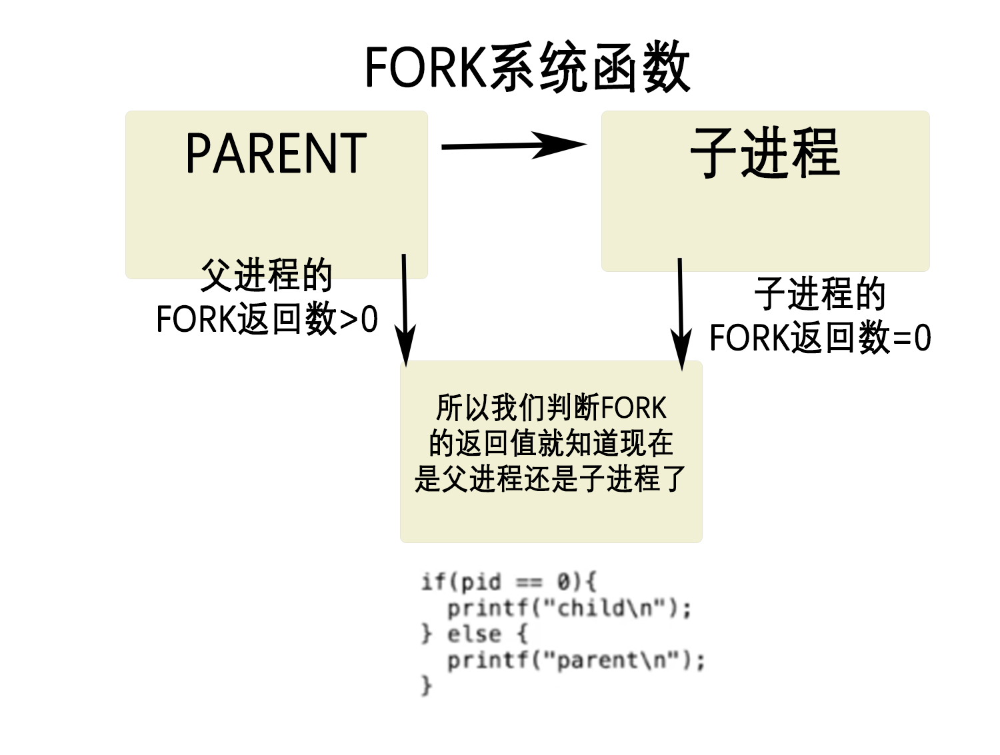
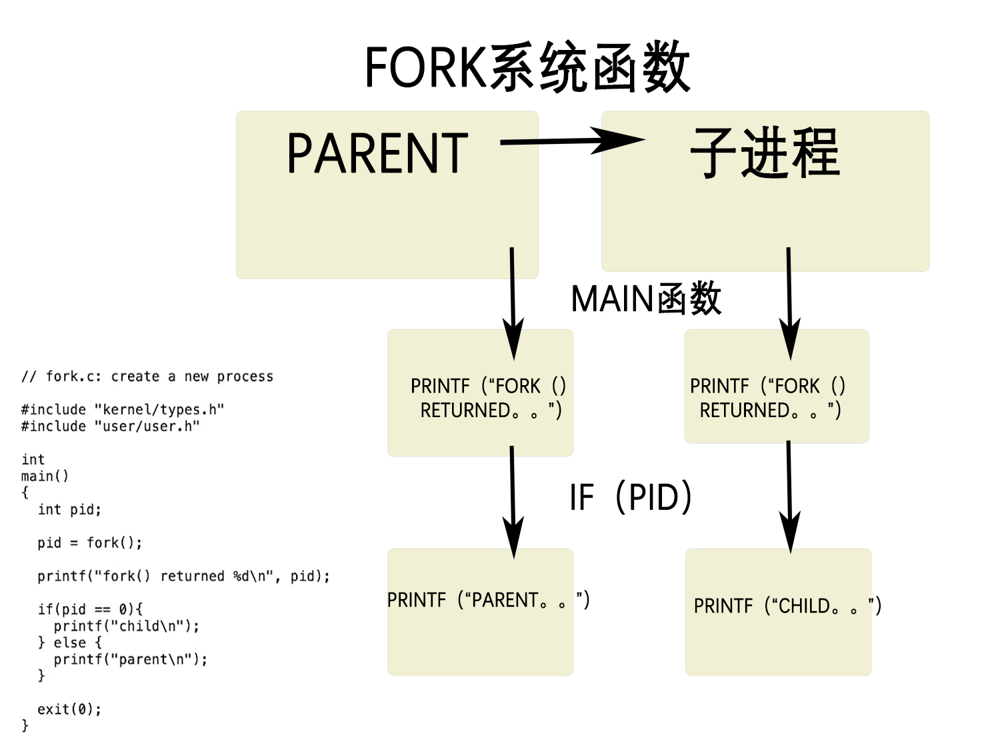

# 6.S081操作系统

参考资料：

[从零实现操作系统-手把手教你搭建环境 - 腾讯云开发者社区-腾讯云 (tencent.com)](https://cloud.tencent.com/developer/article/1872346)

视频课程的中文翻译：[简介 - MIT6.S081 (gitbook.io)](https://mit-public-courses-cn-translatio.gitbook.io/mit6-s081/)

视频课程：[6.S081 / Fall 2020 [麻省理工操作系统 - 2020 年秋季\][中英文字幕]_哔哩哔哩_bilibili](https://www.bilibili.com/video/BV19k4y1C7kA?spm_id_from=333.337.search-card.all.click&vd_source=54d88c3531bbb47aa4123072ef9c00aa)

Ctrl a x  退出QEMU

创建 make qemu

## ** 简介：**

MIT 6.S081是著名的操作系统课程，理论与实践相结合的经典。通过实现部分内核功能来学习设计和实现操作系统。

6.S081 由课程和实验组成。课程的前半部分是介绍系统的各种概念和实现。后半部分是讲一些论文，比如 meldown，et3fs。

实验有 11 个，需要实现不同功能，比如 page table，network driver。

课程的学习打算直接跟着官网的schedule走，先看Lecture下提供的讲义和手册，然后完成相应的Lab，Lab共计11个，主要内容是在xv6基础上进行内核开发和扩展。

每个实验都有对应的知识点供你学习，学完理论知识后会有相应的练习，大多数都需要你手写代码。边学边做，学习效果更加高效。

> 顺便一提，6.S081 2020 的两位老师其中一位是 Robert Morris（RTM）。Robert Morris 写了历史上第一个蠕虫，还是 Y-Combinator 的 co-founder。

现在微内核概念这么火，鸿蒙就被宣传为微内核全场景OS，难道不想从原理上真正理解一下微内核OS吗？而6.S081 这个课程就是引导我们实现了**一个微内核操作系统。**

**我的实现环境：**

- qemu for riscv
- gdb for riscv
- gcc for riscv
- binutils for riscv
- Windows 10 + VMWare + Ubuntu 20.04

**学习资源：**

- 课程官网：https://pdos.csail.mit.edu/6.828/2020/overview.html
- 课程讲义：https://pdos.csail.mit.edu/6.828/2020/xv6/book-riscv-rev1.pdf
- schedule：https://pdos.csail.mit.edu/6.828/2020/schedule.html
- 视频：https://www.bilibili.com/video/BV1Dy4y1m7ZE

## 一、课程内容简介

这门课程的目标有：

1. 理解操作系统的**设计和实现**

   **1.设计是指整体的结构**，2.**实现是指具体的代码长什么样**。对于这两者，我们都会花费大量时间讲解。

2. 

   通过XV6的操作系统深入了解具体的工作原理，研究现有的操作系统，可以扩展，修改并提升操作系统，并且能够==**通过操作系统接口，编写系统软件。**==


所以，这些就是你将要在课程中完成的内容。

我们同时也对操作系统本身的目标感兴趣。对于操作系统的目标，我也列出了几个点。你知道的，市面上有**大量不同的操作系统**，通常来说，他们都有一些共同的目标。

### 1.Abstraction抽象

**第一个就是抽象硬件**。通常来说，你会买一个计算机，里面包含了**CPU，内存**，但是这是一种**非常低层级的资源**。幸好我们有**一些应用程序实现了高层级的接口和抽象**，例如==进程，文件系统。这些高层级的接口和抽象（Abstraction）方便了应用的开发，也提供了更好的移植性。==

### 2.multiplex多复用性

操作系统的另一个重要的任务是：**在多个应用程序之间共用硬件资源**。你可以在一个操作系统同时运行**文本编辑器，程序编译器，多个数据库**等等。==操作系统能非常神奇的在不相互干扰的前提下，同时运行这些程序。这里通常被称为multiplex（多复用的）。==

### 3.isolation隔离性

因为在操作系统中可能同时运行很多程序，即使程序出现了故障，**多个程序之间互不干扰就变得非常重要**。所以这里需要**隔离性（Isolation）**，不同的活动之间不能相互干扰。

为了支持user/kernel mode，处理器会有两种操作模式

第一种是user mode，第二种是**kernel mode**。当运行在kernel mode时，CPU可以运行**特定权限的指令**（privileged instructions）；当运行在user mode时，CPU只能运行普通权限的指令（unprivileged instructions）。

```
普通权限的指令都是一些你们熟悉的指令，例如将两个寄存器相加的指令ADD、将两个寄存器相减的指令SUB、跳转指令JRC、BRANCH指令等等。这些都是普通权限指令，所有的应用程序都允许执行这些指令。

特殊权限指令主要是一些直接操纵硬件的指令和设置保护的指令，例如设置page table寄存器、关闭时钟中断。在处理器上有各种各样的状态，操作系统会使用这些状态，但是只能通过特殊权限指令来变更这些状态。
```

在处理器里面有一个flag。在处理器的一个bit，当它为1的时候是user mode，当它为0时是kernel mode。当处理器在解析指令时，如果指令是特殊权限指令，并且该bit被设置为1，处理器会拒绝执行这条指令，就像在运算时不能除以0一样。

### 协同调度：

当我们只有一个CPU（单核CPU的时候）假设Shell程序发现自己一直在占用CPU，他就会释放CPU资源，让别的进程占用CPU，这个机制就是协同调用（Cooperative Scheduling）。

### 4.sharing共享

但是另一方便，不同的活动之间**有时又想要相互影响**，比如说**数据交互，协同完成任务**等。举个例子，我通过文本编辑器创建了一个文件，并且我希望我的编译器能读取文件，我绝对想要数据能共享。所以，我们希望能在需要的时候实现共享（Sharing）。

### 5.Security安全

但是在很多场景下，用户并不想要共享，比如你登录到了**一个公共的计算机**，例如Athena，你不会想要其他人来读取你的文件。所以在共享的同时，**我们也希望在没有必要的时候不共享**。这里我们称为**Security或者Permission System或者是Access Control System。**

### 6.performance高性能

另一个人们认为操作系统应该具有的价值是：如果你在硬件上花费了大量的金钱，你会期望你的应用程序拥有硬件应该提供的完整性能，但是很多时候你只负责应用程序编程，你会期望操作系统**也必须保证自身提供的服务不会阻止应用程序获得高性能**。所以==操作系统需要至少不阻止应用程序获得高性能，甚至需要帮助应用程序获得高性能（Performance）。==

### 7.Range of oses（操作系统范围）

最后，对于大部分操作系统，必须要支持大量不同类型的应用程序，或许这是一个笔记本，正在运行文本编辑器，正在运行游戏，或许你的操作系统需要支持数据库服务器和云计算。通常来说，**设计并构造一个操作系统代价是非常大的**，所以人们总是希望在相同的操作系统上，例如Linux，**运行大量的任务**。我认为大部分人都已经跑过**Linux**，并使用了我刚刚描述的所有的场景。所以，**同一个操作系统需要能够支持大量不同的用户场景**。


我们期望操作系统能够同时支持上面所有的目标。我们在这门课程中，会介绍更多有关这些目标的内容。

## 二、 操作系统结构

过去几十年，人们将一些**分层的设计思想**加入到操作系统中，并运行的很好。我将会为你列出操作系统经典的组织结构，这个组织结构同时也是这门课程的主要内容，**这里的组织结构对于操作系统来说还是挺常见的**。

有三层：1.硬件底层、2.kernel、3.userspace

### 1、硬件底层

这里实际上就是操作系统内部组成，当我想到这里的组织结构时，我首先会想到用一个矩形表示一个计算机，这个计算机有一些硬件资源，我会将它放在矩形的下面，硬件资源包括了**CPU，内存，磁盘，网卡。**所以硬件资源在最低一层。


### 2、userspame

在这个架构的==最上层==，我们会运行各种各样的==应用程序==，**或许有一个文本编辑器（VI）**，或许有一个C编译器（CC），你还可以运行大量我们今天会讨论的其他事物，例如作为CLI存在的Shell，所以这些就是正在运行的所有程序。这里程序都运行在同一个空间中，**这个空间通常会被称为用户空间（Userspace）**。


### 3、kernel

区别于用户空间程序，有一个特殊的程序总是会在运行，它称为**Kernel**。Kernel是==计算机资源的守护者==。当你打开计算机时，**Kernel总是第一个被启动**。Kernel程序只有一个，**它维护数据来管理每一个用户空间进程**。

#### 3.1、kernel内存管理

==Kernel同时还维护了大量的数据结构来帮助它管理各种各样的硬件资源，以供用户空间的程序使用。==

Kernel同时还有大量内置的服务，例如，**Kernel通常会有文件系统实现类似文件名，文件内容，目录的东西，并理解如何将文件存储在磁盘中。所以用户空间的程序会与Kernel中的文件系统交互，文件系统再与磁盘交互。**


在这门课程中，我们==主要关注点在Kernel==、**连接Kernal和用户空间程序的接口、Kernel内软件的架构**。所以，我们会关心Kernel中的服务，其中一个服务是文件系统，另一个就是进程管理系统。每一个用户空间程序都被称为一个**进程**，它们有自己的**内存和共享的CPU时间**。同时，**Kernel会管理内存的分配。不同的进程需要不同数量的内存，Kernel会复用内存、划分内存，并为所有的进程分配内存。**

#### 3.2、kernel中文件系统。

文件系统通常有一些**逻辑分区**。目前而言，我们可以认为**文件系统的作用是==管理文件内容==并==找出文件具体在磁盘中的哪个位置==**。文件系统还维护了一个独立的命名空间，其中每个文件都有**文件名**，并且命名空间中有一个层级的目录，**每个目录包含了一些文件**。所有这些都被==文件系统所管理==。

**理解：文件在磁盘中是分散的,而操作系统的kernel就是了解把这些发散在磁盘的文件，通过本身文件信息，形成一个有文件名，文件内容，文件目录的文件系统。**

#### 3.3、kernel的安全规则access规则

这里还有一些安全的考虑，我们可以称之为Access Control。当一个进程想要使用某些资源时，比如读取磁盘中的数据，使用某些内存，Kernel中的Access Control机制会决定是否允许这样的操作。对于一个分时共享的计算机，例如Athena系统，这里可能会变得很复杂。因为在Athena系统中，**每一个进程可能属于不同的用户，因此会有不同Access规则来约定哪些资源可以被访问。**

在一个真实的完备的操作系统中，会有很多很多其他的服务，比如在不同进程之间通信的进程间通信服务，比如一大票与网络关联的软件（TCP/IP协议栈），比如支持声卡的软件，比如支持数百种不同磁盘，不同网卡的驱动。所以在一个完备的系统中，Kernel会包含大量的内容，数百万行代码。


这就是对于Kernel的一个快速浏览。

#### 3.4、kernel总结

总结：kernel是一个在用户程序和计算机硬件之间的特殊程序，他的作用是1.交互userspace和硬件，2.分配内存与cup时间给userspace中的应用程序，3.存在文件系统管理磁盘中的文件，并合理分级。4.有access安全规则，保护文件在同一计算机的不同用户。

我们同时也对应用程序是如何与Kernel交互，它们之间的接口长什么样感兴趣。这里通常成为Kernel的API，它决定了应用程序如何访问Kernel。通常来说，这里是通过所谓的系统调用（System Call）来完成。系统调用与程序中的函数调用看起来是一样的，但区别是系统调用会实际运行到系统内核中，并执行内核中对于系统调用的实现。在这门课程的后面，我会详细介绍系统调用。现在，我只会介绍一些系统调用在应用程序中是长什么样的。


## 二、重点理解：操作系统的组织结构。

- 

  Isolation。隔离性是设计操作系统组织结构的**驱动力**。

- 

  Kernel和User mode。这两种模式用来隔离操作**系统内核和用户应用程序。**

- 

  System calls。系统调用是你的应用程序能够转换到**内核执行的基本方法**，这样你的用户态应用程序才能使用内核服务。

- 

  最后我们会看到所有的这些是如何以一种简单的方式在XV6中实现。


首先我们来复习一下上一节课。学习完第一课之后，你应该对操作系统的结构有个大致的认知。

- 

  首先，会有类似于Shell，echo，find或者任何你实现的工具程序，这些程序运行在操作系统之上。

- 

  而操作系统又抽象了一些硬件资源，例如磁盘，CPU。

- 

  通常来说操作系统和应用程序之前的接口被称为**系统调用接口**（System call interface），我们这门课程看到的接口都是Unix风格的接口。基于这些Unix接口，你们在lab1中，完成了不同的应用程序。


#### 3.5、大概了解一下应用程序调用系统函数时，操作系统结构的动作

第一个例子是，如果应用程序需要打开一个文件，它会调用名为**open的系统调用**，并且把文件名作为参数传给open。假设现在要打开一个名为“out”的文件，那么会将文件名“out”作为参数传入。同时我们还希望写入数据，那么还会有一个额外的参数，在这里这个参数的值是1，表明我想要写文件。


这里看起来像是个函数调用，但是**open是一个系统调用**，它会跳到Kernel，Kernel可以获取到open的参数，执行一些实现了open的Kernel代码，或许会与磁盘有一些交互，最后返回一个文件描述符对象。上图中的fd全称就是file descriptor。之后，应用程序可以使用这个文件描述符作为handle，来表示相应打开的文件。



如果你想要向文件写入数据，相应的系统调用是write。你需要向write**传递一个由open返回的文件描述符作为参数**。你还需要向write传递一个指向要写入数据的指针（数据通常是char型序列），在C语言中，可以简单传递一个双引号表示的字符串（下图中的\n表示是换行）。第三个参数是你想要写入字符的数量。

在写文件内容的时候要先调用系统函数open打开文件。


第二个参数的指针，实际上是内存中的地址。所以这里实际上告诉内核，将内存中这个地址起始的**6个字节数据写入到fd对应的文件中**。

另一个你可能会用到的，**更有意思的系统调用是fork**。fork是一个这样的系统调用，它创建了一个与==调用进程一模一样的新的进程==，并返回**新进程的process ID/pid**。这里实际上会复杂的多，我们后面会有更多的介绍。


所以对吧？**这些系统调用看起来就跟普通的函数调用一样。系统调用不同的地方是，它最终会跳到系统内核中。**

这里只是浅尝辄止，我们后面会介绍更多。所以这些是一些快速预览。


##三、 Why Hard and Interesting

我还想说一下为什么我认为学习操作系统是挑战和乐趣并存的？以及为什么我需要专门去学操作系统？

学习操作系统比较难的一个原因是，**内核的编程环境比较困难**。当你在==编写、修改，扩展内核，或者写一个新的操作系统内核时，你实际上在提供一个基础设施让别人来运行他们的程序==。当程序员在写普通的应用程序时，应用程序下面都是操作系统。而当我们在构建操作系统时，在操作系统下面就是硬件了，这些硬件通常会更难处理。在这门课程中，我们会使用一个叫做**QEMU的硬件模拟器**，来模拟CPU和计算机。这会简单一些，但即使这样，编程环境还是比较恶劣。

学习操作系统比较难的另一个原因是，当你在设计一个操作系统时，你需要满足一些列矛盾的需求。

### 1、Hard：

#### 1.1、efficient—abstract（高效率与抽象）

- 要符合高性能**硬件**又要高效接口给**应用程序**

  其中一个是，你想要你的操作系统既高效又易用。高效通常意味着操作系统需要在离硬件近的low-level进行操作，而易用则要求操作系统为应用程序提供抽象的high-level可移植接口。所以，提供一个简单可移植，同时又高效的抽象接口需要一定的技巧。

#### 1.2、powerful—simple（强大与简单）

- 提供一个简单但是又强大的**API接口**

  另一个矛盾的点是，我们想要提供一个非常强大的操作系统服务，这样操作系统才能分担运行应用程序的负担，所以我们需要强大的操作系统服务。但同时，我们也想要有简单的接口。我们不想程序员看到数量巨多，复杂且难以理解的的内核接口。因为，如果他们不理解这些接口，他们就会很难使用这些接口。所以，**我们也想要简单的API**。实际上是有可能提供既简单，同时又包含强大功能的接口。所以，这里要提供一个简单的接口，同时又包含了强大的功能。

> 学生提问：系统调用跳到内核与标准的函数调用跳到另一个函数相比，区别是什么？
>
> Robert教授：Kernel的代码总是有特殊的权限。当机器启动Kernel时，Kernel会有特殊的权限能直接访问各种各样的硬件，例如磁盘。而普通的用户程序是没有办法直接访问这些硬件的。所以，当你执行一个普通的函数调用时，你所调用的函数并没有对于硬件的特殊权限。然而，如果你触发系统调用到内核中，内核中的具体实现会具有这些特殊的权限，这样就能修改敏感的和被保护的硬件资源，比如访问硬件磁盘。我们之后会介绍更多有关的细节。

#### 1.3、flexible—secure（灵活性和安全性）

- 与应用程序最好的灵活性但是又要有安全性

  **最后一个矛盾点是所有的操作系统需要满足的**。你希望给与应用程序尽可能多的**灵活性**，你不会想要限制应用程序，所以你需要内核具备灵活的接口。但是另一方面，你的确需要在某种程度上限制应用程序，因为你会想要**安全性**。我们希望给程序员完全的自由，但是实际上又不能是真正的完全自由，因为我们不想要程序员能直接访问到硬件，干扰到其他的应用程序，或者干扰操作系统的行为。


设计一个好的操作系统还是有可能的，我们后面会大量讨论这个话题。但是想要同时提供上图中两列里面的属性，还是有点难的。

### 2、Interesting

#### 2.1、操作系统有大量服务，服务之间存在交互

操作系统提供了**大量的特性和大量的服务，但是它们趋向于相互交互**。有时，这种交互以奇怪的方式进行，并且需要你大量的思考。即使在我之前给出的一个简单例子中，对于open和fork，它们之间也可能有交互。如果一个应用程序通过open系统调用得到了一个文件描述符fd。之后这个应用程序调用了fork系统调用。fork的语义是创建一个当前进程的拷贝进程。而对于一个真正的拷贝进程，**父进程中的文件描述符也必须存在且可用**。所以在这里，一个通过open获得的文件描述符，与fork以这种有趣的方式进行交互。

子进程是否能够访问到在fork之前创建的文件描述符fd。需要能够访问**。


#### 2.2、需要能够满足广泛的试用场景

另一件有趣的事情，我之前也提到过，**操作系统需要能够满足广泛的使用场景**。相同的操作系统需要既给数据库服务器使用，又给智能手机使用。随着时间的推移，你的计算机所使用的硬件也在变化，或许你有了超级快的SSD存储而不是机械的硬盘。大概15年前，多核CPU计算机还极其稀有，而现在变得极其的流行。最近，我们又看到了网速以指数级增长。所有的这些都需要时不时的重新思考，操作系统是如何被设计的。

前面理性的分析了一下为什么你要学习这门课程。同时，这里也有一些更加实际的原因来告诉你**为什么会选择这门课程**。

- 计算机运行原理

  其中一个原因是，如果你对于**计算机的运行原理感兴趣**，对于你打开计算机以后实际发生的事情感兴趣。

- 基础架构

  类似的，如果你**喜欢基础架构**，比如你喜欢构建一些其他程序可以使用的服务，那么这门课程都是有关基础架构的内容，因为**操作系统就是基础架构。**

- 解决应用程序的很多问题

  如果你曾经**花费了大量的时间来定位应用程序的Bug**，或者**定位安全的问题**，那么你会发现这些经历**通常需要理解操作系统是如何运作**的。比如从根本上来说，==操作系统涉及了很多安全相关的策略。当程序运行出错时，操作系统需要来收拾残局，而这一步也通常包括在定位问题中==。

> 学生提问：对于应用程序开发人员来说，他们会基于一些操作系统做开发，真正的深入理解这些操作系统有多重要？他们需要成为操作系统的专家吗？
>
> Robert教授：你不必成为一个专家。但是如果你花费大量时间来开发，维护并调试应用程序，你最终还是会知道大量操作系统的知识。不论你是否是有意要掌握这些知识，它们就是出现了，而你不得不去理解它们。
>
> 学生提问：对于一些例如Python的高阶编程语言（高阶是指离自然语言更接近，低阶是指离机器语言更接近如C，汇编），它们是直接执行系统调用呢，还是内部对系统调用进行了封装呢？
>
> Robert教授：许多高阶的编程语言都离系统调用较远，这是一个事实。部分原因是很多编程语言想要提供可以在多个操作系统上运行的可移植的环境，所以它们不能依赖特定的系统调用。所以，对于这个问题的答案我认为是，如果你使用了Python，你在某种程度上就与系统调用接口隔离了。当然，在Python内部，最终还是要执行系统调用来完成相应的工作。当然，Python和许多其他的编程语言通常都有方法能直接访问系统调用。


## 四、 课程结构和资源

我们会讲解**操作系统的基本概念**。会专注于学习XV6中的代码，XV6是我们的一个**小的用于教学的操作系统**，我们会介绍它是如何工作，查看它的代码，并在课程中演示代码的运行。

XV6如何运行以及设计思想

解释C语言是如何工作的，例如介绍RISC-V是如何工作的，这是我们将要使用的一个微处理器。这些内容对于你们完成实验是有帮助的。

有一大大部分是**lab**，几乎每周都会有一些编程实验。实验的意义在于帮助你**获得一些使用和实现操作系统的实际动手经验**。比如说，下周截止的实验实际上是写一些应用程序代码来执行我们之前谈到的系统调用，之后的大部分实验则要求你要么实现基本的操作系统功能或者扩展XV6操作系统。最后一个lab会要求你添加==一个网络协议栈和一个网络驱动==，这样操作系统才能连接到网络上。

## 五、 read, write, exit系统调用

系统调用长成什么样。因为系统调用是**操作系统提供的服务的接口**，所以系统调用长什么样，**应用程序期望从系统调用得到什么返回，系统调用是怎么工作的**，这些还是挺重要的。你会在第一个lab中使用我们在这里介绍的系统调用，并且在后续的lab中，扩展并提升这些系统调用的内部实现。

我接下来会展示一些简单的例子，这些例子中会执行系统调用，并且我会在XV6中运行这些例子。**XV6是一个简化的类似Unix的操作系统**，而Unix是一个老的操作系统，但是同时也是很多现代操作系统的基础，例如**Linux，OSX。所以Unix使用的非常广泛。而作为我们教学用的操作系统，XV6就要简单的多。它是受Unix启发创造的，有着相同的文件结构，但是却要比任何真实的Unix操作系统都要简单的多**。

**XV6运行在一个RISC-V微处理器上**，而RISC-V是MIT6.004课程讲解的处理器，所以你们很多人可能已经知道了**RISC-V指令集**。理论上，你可以在一个RISC-V计算机上运行XV6，已经有人这么做了。**但是我们会在一个QEMU模拟器上运行XV6。**

==Xv6是由[麻省理工学院](https://baike.baidu.com/item/麻省理工学院/117999?fromModule=lemma_inlink)(MIT)为操作系统工程的课程（代号6.828）,开发的一个教学目的的操作系统。Xv6是在x86处理器上(x即指x86)用[ANSI标准](https://baike.baidu.com/item/ANSI标准/3127116?fromModule=lemma_inlink)C重新实现的Unix第六版(Unix V6，通常直接被称为V6)。==

==**RISC-V**（发音为“risk-five”）是一个基于[精简指令集](https://baike.baidu.com/item/精简指令集?fromModule=lemma_inlink)（RISC）原则的[开源](https://baike.baidu.com/item/开源?fromModule=lemma_inlink)[指令集架构](https://baike.baidu.com/item/指令集架构?fromModule=lemma_inlink)（ISA）。==

==QEMU是模拟器，模拟我们的电脑硬件，有较高的速度。==

操作系统是XV6，它运行在RISC-V微处理器上，当然不只是RISC-V微处理器，我们假设有一定数量的其他硬件存在，例如内存，磁盘和一个**console接口**，这样我们才能跟操作系统进行交互。但是实际上，**XV6运行在QEMU模拟器之上。这样你们都能在没有特定硬件的前提下，运行XV6。**


首先设置好XV6。首先输入make qemu，实验中会经常用到这个命令。这个命令**会编译XV6**，而XV6是用C语言写的。先执行一下make clean，这样就能看到完整的编译过程。


之后我输入make qemu，这条指令会编译并构建xv6内核和所有的用户进程，并将它们运行在QEMU模拟器下。


编译需要花费一定的时间。


现在xv6系统已经起来并运行了。**$表示Shell**，这是参照Unix上Shell的命令行接口。如果你用过Athena工作站，它的Shell与这里的非常像。XV6本身很小，并且自带了一小部分的工具程序，例如ls。我这里运行ls，它会输出xv6中的所有文件，这里只有20多个。


可以看到，这里还有grep，kill，mkdir和rm，或许你们对这些程序很熟悉，因为它们在Unix中也存在。

我向你们展示的第一个系统调用是一个叫做copy的程序。


它的源代码只有不到一页。你们这里看到的是一个程序，它从第8行的main开始，这是C程序的风格。它在第12行进入到一个循环中，在循环中，它会在第13行从输入读取一些数据，并在第16行，将数据写入到输出。如果我在XV6中运行这个copy程序。


它会等待输入。我随便输入一些字符，程序会读取我输入的字符，并将相同的字符输出给我。


所以这是一个非常简单的程序。如你所看到的，这个程序是用C语言写的，如果你不懂C语言，那最好还是去读一本标准的[C编程语言](https://zh.wikipedia.org/wiki/C程序设计语言_(书))。这个程序里面执行了3个系统调用，分别是read，write和exit。

如果你看第13行的read，它接收3个参数：

- 文件描述符(0/1)

  第一个参数是文件描述符，指向一个之前打开的文件。Shell会确保默认情况下，当一个程序启动时，文件描述符0连接到console的输入，文件描述符1连接到了console的输出。所以我可以通过这个程序看到console打印我的输入。当然，这里的程序会预期文件描述符已经被Shell打开并设置好。这里的0，1文件描述符是非常普遍的Unix风格，许多的Unix系统都会从文件描述符0读取数据，然后向文件描述符1写入数据。

- 指针

  read的第二个参数是指向某段内存的指针，程序可以通过指针对应的地址读取内存中的数据，这里的指针就是代码中的buf参数。在代码第10行，**程序在栈里面申请了64字节的内存，并将指针保存在buf中，这样read可以将数据保存在这64字节中**。

- 存取的数据长度

  read的第三个参数是代码想读取的最大长度，==sizeof(buf)表示，最多读取64字节的数据==，所以这里的read最多只能从连接到文件描述符0的设备，也就是console中，读取64字节的数据。

read的返回值可能是读到的字节数，在上面的截图中也就是6（xyzzy加上结束符）。read可能从一个文件读数据，如果到达了文件的结尾没有更多的内容了，read会返回0。如果出现了一些错误，比如文件描述符不存在，read或许会返回-1。在后面的很多例子中，比如第16行，我都没有通过检查系统调用的返回来判断系统调用是否出错，但是你应该比我更加小心，**应该清楚系统调用通常是通过返回-1来表示错误，你应该检查所有系统调用的返回值以确保没有错误。**

如果你想知道所有的系统调用的参数和返回值是什么，在XV6书籍的第二章有一个表格。

> 学生提问：如果read的第三个参数设置成1 + sizeof(buf)会怎样？
>
> Robert教授：如果第三个参数是65字节，操作系统会拷贝65个字节到你提供的内存中（第二个参数）。但是如果栈中的==第65个字节有一些其他数据，那么这些数据会被覆盖，这里是个bug==，或许会导致你的代码崩溃，或者一些异常的行为。所以，作为一个程序员，你必须要小心。C语言很容易写出一些编译器能通过的，但是最后运行时出错的代码。虽然很糟糕，但是现实就是这样。

copy、read、write系统调用，它们并不关心读写的数据格式，它们就是单纯的读写，而copy程序会按照8bit的字节流处理数据，你怎么解析它们，完全是用应用程序决定的。所以应用程序可能会解析这里的数据为C语言程序，但是操作系统只会认为这里的数据是按照8bit的字节流。

## 六、 open系统调用

前面，copy代码假设文件描述符已经设置好了。

但是一般情况下，我们需要能创建文件描述符，最直接的创建文件描述符的方法是open系统调用。下面是一个叫做open的源代码，它使用了open系统调用。


> 学生提问：字节流是什么意思？
>
> Robert教授：如果一个文件包含了一些字节，假设包含了数百万个字节，你触发了多个read，每个read读取100个字节，第一次read会读取前100个字节，第二次读取101-200个字节，第三次读取201-300个字节，这就是我的意思。（==字节流就是一段连续的数据按照字节的长度读取==）

这个叫做open的程序，会创建一个叫做output.txt的新文件，并向它写入一些数据，最后退出。我们看不到任何输出，因为它只是向打开的文件中写入数据。


但是我们可以查看output.txt的内容。


open系统调用，将文件名output.txt作为参数传入，第二个参数（**create创建文件，wronly只写**）是一些标志位，**用来告诉open系统调用在内核中的实现**：我们将要创建并写入一个文件。

open系统调用会返回一个新分配的文件描述符，这里的文件描述符是一个小的数字，可能是2，3，4或者其他的数字。

之后，这个文件描述符作为第一个参数被传到了write，write的第二个参数是数据的指针，第三个参数是要写入的字节数。数据被写入到了文件描述符对应的文件中。

**文件描述符**本质上对应了**内核中的一个表单数据**。内核维护了每个运行进程的状态，内核会为每一个运行进程保存一个表单，**表单的key是文件描述符**。这个表单让内核知道，每个文件描述符对应的实际内容是什么。这里比较关键的点是，==每个进程都有自己独立的文件描述符空间==，所以如果运行了两个不同的程序，对应两个不同的进程，如果它们都打开一个文件，它们或许可以得到相同数字的文件描述符，但是因为内核为每个进程都维护了一个独立的文件描述符空间，==这里相同数字的文件描述符可能会对应到不同的文件。==

> 学生提问：我不太熟悉C语言，这里的文件描述符与非C语言中有什么区别？如果使用Python的话，语法上会不会简单点？
>
> Robert教授：Python肯定提供了对于open的较好的封装。通常来说，Python提供的是更高级的函数，比如说Python不会使用指向内存的指针，并且Python会为你做更多的错误检查。当我们在Python中打开文件或者写入文件时，**你在Python中的调用最终会走到跟我们例子中一样的系统调用来**.


## 七、 Shell

很多XV6的长的很像Unix的Shell，相对图形化用户接口来说，这里的Shell通常也是人们说的**命令行接口**。

Shell是一种对于Unix系统管理来说非常有用的接口，它提供了很多工具来管理文件，**编写程序，编写脚本**。通常来说，输入内容时，是在**告诉Shell运行相应的程序。**

我现在运行ls，它实际的工作就是输出当前目录的文件列表。


看到第4行，就是一个叫做ls的文件。这就是包含了计算机指令的文件。

除了运行程序以外，Shell还会做一些其他的事情，比如，它允许你能**重定向IO**。比如，输入 ls > out


 ls > out：要求Shell运行ls命令，但是将输出重定向到一个叫做out的文件中。原本输入在界面上的内容，输入在了out文件中。

你也可以运行一个名为**grep的指令**，并将x作为参数传给grep。


grep x会搜索输入中包含x的行，我可以告诉shell将输入重定向到文件out，这样我们就可以查看out中的x。


我们将会花很多时间在Shell上，**Shell是最传统，最基础的Unix接口**。

> 学生提问：有一个系统调用和编译器的问题。编译器如何处理系统调用？生成的汇编语言是不是会调用一些由操作系统定义的代码段？
>
> Robert教授：有一个特殊的**RISC-V指令**，程序可以调用这个指令，并将控制权交给内核。所以，实际上当你运行C语言并执行例如open或者write的系统调用时，从技术上来说，open是一个C函数，但是这个函数内的指令实际上是机器指令，也就是说我们==调用的open函数并不是一个C语言函数，它是由汇编语言实现，组成这个系统调用的汇编语言实际上在RISC-V中被称为ecall。这个特殊的指令将控制权转给内核==。之后内核检查进程的内存和寄存器，并确定相应的参数。


## 八、 fork系统调用

下一个我想查看的例子叫做fork。fork会创建一个新的进程，下面是使用fork的一个简单用例。


调用fork。fork会拷贝**当前进程的内存**，并**创建一个新的进程**，这里的内存包含了进程的指令和数据。之后，我们就有了两个拥有完全一样内存的进程。fork系统调用在两个进程中都会返回，在原始的进程中，**fork系统调用会返回大于0的整数，这个是新创建进程的ID**。而在新创建的进程中，fork系统调用会返回0。所以即使两个进程的内存是完全一样的，我们还是可以通过fork的返回值区分旧进程和新进程。

我画个图：



文字解释：代码检查pid。如果pid等于0，那么这必然是子进程。父进程看到的pid必然大于0。所以父进程会打印“parent”，子进程会打印“child”。之后两个进程都会退出。接下来我运行这个程序：




这里实际发生的是：fork系统调用之后，两个进程都在同时运行，**QEMU实际上是在模拟多核处理器**，所以这两个进程实际上就是同时在运行。所以当这两个进程在输出的时候，它们会同时一个字节一个字节的输出，两个进程的输出交织在一起。

0，这是子进程的输出。父进程返回了19，作为子进程的进程ID。一个进程打印了child，另一个打印了parent。所以，==**fork（在子父进程中）返回不同的值是比较重要的。**==

> 学生提问：fork产生的子进程是不是总是与父进程是一样的？它们有可能不一样吗？
>
> Robert教授：在XV6中，==除了fork的返回值，两个进程是一样的。==两个进程的指令是一样的，数据是一样的，栈是一样的，同时，两个进程又有各自独立的地址空间，它们都认为自己的内存从0开始增长，但这里是不同的内存。 在一个更加复杂的操作系统，有一些细节我们现在并不关心，这些细节偶尔会导致父子进程不一致，但是在XV6中，父子进程除了fork的返回值，其他都是一样的。除了内存是一样的以外，文件描述符的表单也从父进程拷贝到子进程。所以如果父进程打开了一个文件，子进程可以看到同一个文件描述符，尽管子进程看到的是一个文件描述符的表单的拷贝。除了拷贝内存以外，fork还会拷贝文件描述符表单这一点还挺重要的，我们接下来会看到。

fork创建了一个新的进程。当我们在Shell中运行东西的时候，Shell实际上会创建一个新的进程来运行你输入的每一个指令。所以，当我输入ls时，我们需要Shell通过fork创建一个进程来运行ls，这里需要某种方式来让这个新的进程来运行ls程序中的指令，加载名为ls的文件中的指令（也就是后面的exec系统调用）。

## 九、 exec, wait系统调用

### 1、echo：

echo是一个非常简单的命令，它**接收任何你传递给它的输入，并将输入写到输出**。


### 2、exec：

exec的代码：


**代码会执行exec系统调用**，这个系统调用会从指定的文件中读取并加载指令，**并替代当前调用进程的指令**。从某种程度上来说，==这样相当于丢弃了调用进程的内存，并开始执行新加载的指令。==所以第12行的系统调用exec会有这样的效果：操作系统从名为echo的文件中加载指令到当前的进程中，并替换了当前进程的内存，之后开始执行这些新加载的指令。同时，你可以传入命令行参数，exec允许你传入一个命令行参数的数组，这里就是一个C语言中的指针数组，在上面代码的第10行设置好了一个字符指针的数组，这里的字符指针本质就是一个字符串（string）。

所以这里等价于运行echo命令，并带上“this is echo” 这三个参数。所以当我运行exec文件，


我可以看到“this is echo”的输出。即使我运行了exec程序，exec程序实际上会调用exec系统调用，并用echo指令来代替自己，所以这里是echo命令在产生输出。

有关exec系统调用，有一些重要的事情，

1. 1.

   exec系统调用会保留当前的文件描述符表单。所以任何在exec系统调用之前的文件描述符，例如0，1，2等。它们在新的程序中表示相同的东西。

2. 2.

   通常来说exec系统调用不会返回，因为exec会完全替换当前进程的内存，相当于**当前进程不复存在**了，所以exec系统调用已经没有地方能返回了。

所以，exec系统调用从文件中读取指令，执行这些指令，然后就没有然后了。exec系统调用**只会当出错时才会返回**，因为某些错误会阻止操作系统为你运行文件中的指令，例如程序文件根本不存在，因为exec系统调用不能找到文件，exec会返回-1来表示：出错了，我找不到文件。所以通常来说exec系统调用不会返回，它只会在kernel不能运行相应的文件时返回。

> argv中的最后一个0是什么意思？
>
> 它标记了数组的结尾。C是一个非常低阶（接近机器语言）的编程语言，并没有一个方法来确定一个数组究竟有多长。所以为了告诉内核数组的结尾在哪，我们将0作为最后一个指针。argv中的每一个字符串实际上是一块包含了数据的内存指针，但是第5个元素是0，通常来说指针0是一个NULL指针，它只表明结束。==所以内核中的代码会遍历这里的数组，直到它找到了值为0的指针。==

这就是一个程序如何用文件中的另一个程序来替代自己。实际上，当我们在Shell中运行类似于“echo a b c”的指令，或者ls，或者任何命令，我们不会想要代替Shell进程，所以我们不会希望Shell执行exec系统调用。如果我们这么做了，这里会用echo指令来替代Shell进程，当echo退出了，一切就结束了。所以我们不想要echo替代Shell。实际上，Shell会执行fork，**之后fork出的子进程再调用exec系统调用**，这是一个非常常见的Unix程序调用风格。==对于那些想要运行程序，但是还希望能拿回控制权的场景，可以先执行fork系统调用，然后在子进程中调用exec==。

这里有一个简单的例子，来演示fork/exec程序。


在这个程序中的第12行，调用了fork。子进程从第14行开始，我们在子进程中与前一个程序一样调用exec。子进程会用echo命令来代替自己，echo执行完成之后就退出。之后父进程重新获得了控制。fork会在父进程中返回大于0的值，父进程会继续在第19行执行。

Unix提供了一个wait系统调用，如第20行所示。**wait会等待之前创建的子进程退出**。当我在命令行执行一个指令时，我们一般会希望Shell等待指令执行完成。所以wait系统调用，使得父进程可以等待任何一个子进程返回。**这里wait的参数status，是一种让退出的子进程以一个整数（32bit的数据）的格式与等待的父进程通信方式**。所以在第17行，**exit的参数是1**，操作系统会将1从退出的子进程传递到第20行，也就是等待的父进程处。**&status，是将status对应的地址传递给内核，内核会向这个地址写入子进程向exit传入的参数。**

Unix中的风格是，如果**一个程序成功的退出了，那么exit的参数会是0**，如果出现了错误，那么就会像第17行一样，会向exit传递1。所以，如果你关心子进程的状态的话，父进程可以读取wait的参数，并决定子进程是否成功的完成了。

> 学生提问：有关第15行的exec系统调用，在刚刚提到exec会完全走到echo程序，而不会返回到fork出的子进程中，所以代码有可能走到底16，17行吗？
>
> Robert教授：对于上面例子中的exec，代码不会走到16，17行，因为这里就是调用了echo。但是，如果我修改代码，那就有可能会走到那两行了。首先，我先运行一下原始版本的程序


> 可以看出，程序执行了echo，并传入了相应的参数。同时子进程以状态0退出，表明echo成功的退出了，并且父进程在等待子进程。
>
> 接下来，我修改一下代码。这次我将会运行一个不存在的指令，


> 为了让修改生效，我需要退出QEMU，并重建所有的东西以使得我的修改能够被编译。之后我再运行forkexec，


> 这一次，因为我们想要执行的指令并不存在，exec系统调用会返回，我们可以看到“**exec failed!”的输出**，同时exit(1)的参数1，传递给了父进程，**父进程会打印出子进程的退出码。所以，exec系统调用只会在出错的时候返回给调用进程。**

这里有一些东西需要注意，实际上我认为你们很多人已经注意到了，这里是一个常用的写法，先调用fork，再在子进程中调用exec。这里实际上有些浪费，fork首先拷贝了整个父进程的，但是之后exec整个将这个拷贝丢弃了，并用你要运行的文件替换了内存的内容。某种程度上来说这里的拷贝操作浪费了，因为所有拷贝的内存都被丢弃并被exec替换。在大型程序中这里的影响会比较明显。==如果你运行了一个几G的程序，并且调用fork，那么实际就会拷贝所有的内存，可能会要消耗将近1秒钟来完成拷贝，这可能会是个问题。==

在这门课程的后面，你们会实现一些优化，比如说**copy-on-write fork**，这种**方式会消除fork的几乎所有的明显的低效**，而只拷贝执行exec所需要的内存，这里需要很多涉及到虚拟内存系统的技巧。你可以构建一个fork，对于内存实行lazy拷贝，通常来说fork之后立刻是exec，这样你就不用实际的拷贝，因为子进程实际上并没有使用大部分的内存。我认为你们会觉得这将是一个有趣的实验。

> 学生提问：为什么父进程在子进程调用exec之前就打印了“parent waiting”？
>
> Robert教授：这里只是巧合。父进程的输出有可能与子进程的输出交织在一起，就像我们之前在fork的例子中看到的一样，只是这里正好没有发生而已。并不是说我们一定能看到上面的输出，实际上，如果看到其他的输出也不用奇怪。我怀疑这里背后的原因是，exec系统调用代价比较高，它需要访问文件系统，访问磁盘，分配内存，并读取磁盘中echo文件的内容到分配的内存中，分配内存又可能需要等待内存释放。所以，exec系统调用背后会有很多逻辑，很明显，处理这些逻辑的时间足够长，这样父进程可以在exec开始执行echo指令之前完成输出。这样说得通吧？
>
> 学生提问：子进程可以等待父进程吗？
>
> Robert教授：Unix并没有一个直接的方法让子进程等待父进程。==wait系统调用只能等待当前进程的子进程==。所以wait的工作原理是，如果当前进程有任何子进程，并且其中一个已经退出了，那么wait会返回。但是如果当前进程没有任何子进程，比如在这个简单的例子中，如果子进程调用了wait，因为子进程自己没有子进程了，所以wait会立即返回-1，表明出现错误了，当前的进程并没有任何子进程。
>
> 简单来说，不可能让子进程等待父进程退出。
>
> 学生提问：当我们说子进程从父进程拷贝了所有的内存，这里具体指的是什么呢？是不是说子进程需要重新定义变量之类的？
>
> Robert教授：在编译之后，你的C程序就是一些在内存中的指令，这些指令存在于内存中。所以这些指令可以被拷贝，因为它们就是内存中的字节，它们可以被拷贝到别处。通过一些有关虚拟内存的技巧，可以使得子进程的内存与父进程的内存一样，这里实际就是将父进程的内存镜像拷贝给子进程，并在子进程中执行。
>
> 实际上，当我们在看C程序时，你应该认为它们就是一些机器指令，这些机器指令就是内存中的数据，所以可以被拷贝。
>
> 学生提问：如果父进程有多个子进程，wait是不是会在第一个子进程完成时就退出？这样的话，还有一些与父进程交错运行的子进程，是不是需要有多个wait来确保所有的子进程都完成？
>
> Robert教授：是的，如果一个进程调用fork两次，如果它想要等两个子进程都退出，它需要调用wait两次。每个wait会在一个子进程退出时立即返回。当wait返回时，你实际上没有必要知道哪个子进程退出了，但是wait返回了==**子进程的进程号**==，所以在wait返回之后，你就可以知道是哪个子进程退出了。


## 十、I/O Redirect

实现I/O重定向：


Shell提供了方便的I/O重定向工具。==（**>**内容定向文件）    （**<**定向内容输出）==

Shell之所以有这样的能力，是因为Shell首先会像第13行一样fork，然后在子进程中，Shell改变了文件描述符。文件描述符1通常是进程用来作为输出的（也就是console的输出文件符），Shell会将文件描述符1改为output文件，之后再运行你的指令。同时，父进程的文件描述符1并没有改变。所以这里先fork，再更改子进程的文件描述符，是Unix中的常见的用来重定向指令的输入输出的方法，这种方法同时又不会影响父进程的输入输出。因为我们不会想要重定向Shell的输出，我们只想重定向子进程的输出。

这里之所以能工作的原因是，代码的第15行只会在子进程中执行。代码的第15行的意义是重定向echo命令的输出，如果我运行整个程序redirect程序。


可以看到没有任何的输出。但是实际上redirect程序里面运行了echo，只是echo的输出重定向到了output.txt。如果我们查看output.txt，


close(1)的意义是，将原本的文件描述符删除，为了下面open返回1

open一定会返回1，因为open会返回当前进程未使用的最小文件描述符序号。因为我们刚刚关闭了文件描述符1，而文件描述符0还对应着console的输入，所以open一定可以返回1。文件描述符1与文件output.txt关联。

之后我们执行exec(echo)，**echo会输出到文件描述符1**，也就是文件output.txt。

这个例子同时也演示了分离fork和exec的好处。fork和exec是分开的系统调用，意味着在子进程中有一段时间，fork返回了，但是exec还没有执行，子进程仍然在运行父进程的指令。所以这段时间，尽管指令是运行在子进程中，但是这些指令仍然是父进程的指令，所以父进程仍然可以改变东西，直到代码执行到了第19行。这里fork和exec之间的间隔，提供了Shell修改文件描述符的可能。

总结：

- 

  看了一些**Unix I/O和进程的接口和抽象**。这里需要记住的是，接口是相对的简单，你只需要传入**表示文件描述符的整数**，和进程ID作为参数给相应的系统调用。而接口内部的实现逻辑相对来说是复杂的，比如创建一个新的进程，拷贝当前进程。

- 

  接口本身是简单的，但是可以将多个接口结合起来形成复杂的用例。比如说创建I/O重定向。

# Lex02 OS Organization and System Calls（Frans）

## 一、user/kernel切换

user/kernel mode是分隔用户空间和内核空间的边界，用户空间运行的程序运行在user mode，内核空间的程序运行在kernel mode。操作系统位于内核空间。

Shell程序会调用fork或者exec系统调用，所以必须要有一种方式可以使得用户的应用程序能够将控制权以一种协同工作的方式转移到内核，这样内核才能提供相应的服务。


需要有一种方式能够让应用程序可以将控制权转移给内核（Entering Kernel）。

在RISC-V中，有一个专门的指令用来实现这个功能，叫做ECALL。ECALL接收一个数字参数，当一个用户程序想要将程序执行的控制权转移到内核，它只需要执行ECALL指令，并传入一个数字。这里的数字参数代表了应用程序想要调用的System Call。


ECALL会跳转到内核中一个特定，由内核控制的位置。我们在这节课的最后可以看到在XV6中存在一个唯一的系统调用接入点，每一次应用程序执行ECALL指令，应用程序都会通过这个接入点进入到内核中。举个例子，不论是Shell还是其他的应用程序，当它在用户空间执行fork时，它并不是直接调用操作系统中对应的函数，而是调用ECALL指令，并将fork对应的数字作为参数传给ECALL。之后再通过ECALL跳转到内核。


## 二、Monolithic Kernel  &  Micro Kernel

user/kernel边界，在上面是应用程序，在下面是运行在kernel mode的程序。


其中一个选项是让整个操作系统代码都运行在kernel mode。大多数的Unix操作系统实现都运行在kernel mode。比如，XV6中，所有的操作系统服务都在kernel mode中，这种形式被称为Monolithic Kernel Design（[宏内核](https://en.wikipedia.org/wiki/Monolithic_kernel)）。


这里有几件事情需要注意：

- 

  首先，如果考虑Bug的话，这种方式不太好。在一个宏内核中，任何一个操作系统的Bug都有可能成为漏洞。因为我们现在在内核中运行了一个巨大的操作系统，出现Bug的可能性更大了。你们可以去查一些统计信息，平均每3000行代码都会有几个Bug，所以如果有许多行代码运行在内核中，那么出现严重Bug的可能性也变得更大。所以从安全的角度来说，在内核中有大量的代码是宏内核的缺点。

- 

  另一方面，如果你去看一个操作系统，它包含了各种各样的组成部分，比如说文件系统，虚拟内存，进程管理，这些都是操作系统内实现了特定功能的子模块。宏内核的优势在于，因为这些子模块现在都位于同一个程序中，它们可以紧密的集成在一起，这样的集成提供很好的性能。例如Linux，它就有很不错的性能。

上面是对于内核的一种设计方式。


另一种设计主要关注点是减少内核中的代码，它被称为Micro Kernel Design（[微内核](https://en.wikipedia.org/wiki/Microkernel)）。在这种模式下，希望在kernel mode中运行尽可能少的代码。所以这种设计下还是有内核，但是内核只有非常少的几个模块，例如，内核通常会有一些IPC的实现或者是Message passing；非常少的虚拟内存的支持，可能只支持了page table；以及分时复用CPU的一些支持。

微内核的目的在于将大部分的操作系统运行在内核之外。所以，我们还是会有user mode以及user/kernel mode的边界。但是我们现在会将原来在内核中的其他部分，作为普通的用户程序来运行。比如文件系统可能就是个常规的用户空间程序。这个文件系统我不小心画成了红色，其实我想画成黑色的。


现在，文件系统运行的就像一个普通的用户程序，就像echo，Shell一样，这些程序都运行在用户空间。可能还会有一些其他的用户应用程序，例如虚拟内存系统的一部分也会以一个普通的应用程序的形式运行在user mode。


某种程度上来说，这是一种好的设计。因为在内核中的代码的数量较小，更少的代码意味着更少的Bug。

但是这种设计也有相应的问题。假设我们需要让Shell能与文件系统交互，比如Shell调用了exec，必须有种方式可以接入到文件系统中。通常来说，这里工作的方式是，Shell会通过内核中的IPC系统发送一条消息，内核会查看这条消息并发现这是给文件系统的消息，之后内核会把消息发送给文件系统。


文件系统会完成它的工作之后会向IPC系统发送回一条消息说，这是你的exec系统调用的结果，之后IPC系统再将这条消息发送给Shell。


所以，这里是典型的通过消息来实现传统的系统调用。现在，对于任何文件系统的交互，都需要分别完成2次用户空间<->内核空间的跳转。与宏内核对比，在宏内核中如果一个应用程序需要与文件系统交互，只需要完成1次用户空间<->内核空间的跳转，所以微内核的的跳转是宏内核的两倍。通常微内核的挑战在于性能更差，这里有两个方面需要考虑：

1. 1.

   **在user/kernel mode反复跳转带来的性能损耗。**

2. 2.

   在一个类似宏内核的**紧耦合系统**，各个组成部分，例如文件系统和虚拟内存系统，可以很容易的共享page cache。      而在微内核中，每个部分之间都**很好的隔离开了**，这种共享更难实现。进而导致更难在微内核中得到更高的性能。

历史原因大部分的桌面操作系统是宏内核，如果你运行需要大量内核计算的应用程序，例如在数据中心服务器上的操作系统，通常也是使用的宏内核，主要的原因是Linux提供了很好的性能。但是很多嵌入式系统，例如Minix，Cell，这些都是微内核设计。这两种设计都很流行，如果你从头开始写一个操作系统，你可能会从一个微内核设计开始。但是一旦你有了类似于Linux这样的宏内核设计，将它重写到一个微内核设计将会是巨大的工作。并且这样重构的动机也不足，因为人们总是想把时间花在实现新功能上，而不是重构他们的内核。


