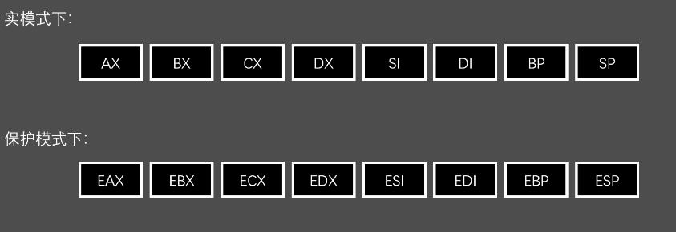
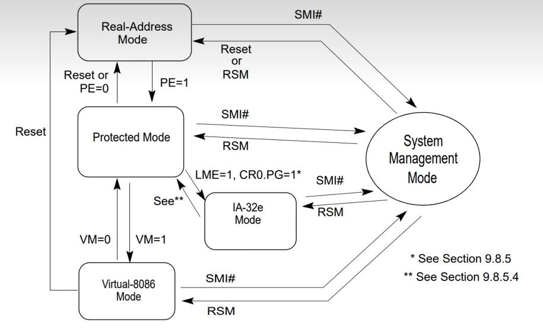
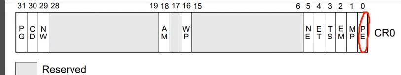
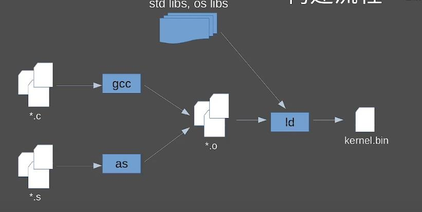

## 保护模式：

保护模式（protected Mode，又称PMode），是x86系列**CPU的一种运行模式**。

x86系列CPU有五种模式：**实模式（16位），保护模式（32位），IA-32e模式**，SMM（系统管理模式），虚拟8086模式。

因为x86是inter第一个32位的CPU，所以我们叫x86为32位cpu

### 在保护模式下面，可以：

- 使用更大的32位寄存器
- 使用更多的内存，多达4GB（如果目标机器安装了足够的RAM的话）
  - 2^32*1024^-3=4
- **能够执行C语言编译过来的机器码！（我们真正的目的）**

### 有得必有失：

- **不能**使用BIOS提供给我们得例程（各种int 中断号）
- **不能**访问磁盘，读取内存大小，从屏幕上显示文字，等等需要通过BIOS中断使用得功能
- 没有系统调用，没有标准库，没有异常捕获，什么都没有。一切要自己造轮子。
- CPU变得更加脆弱，哪怕就是一个轻微得bug（比如1/0这类运算），都可能直接导致==TrIpleFault==（电脑宕机）

### 保护模式下的寄存器：

- 前面都追加了一个“E”作为前缀
- 但并不是所有得寄存器都是这样！
- 段寄存器：CS,ES,DS,SS 依然维持原样，并且大小也维持在16位

#### 为什么还是段寄存器16位？

### 保护模式如何保护：

**保护模式主要是对内存区域的保护**

​	从而保障了进程（的专属内存空间）之间的安全。

**保护模式允许我们：**

- 对内存进行分区。
- 对每个分区进行单独的配置。
- 比如权限，功能，等等其他一推属性

**保护模式就是绘制一幅内存地图---更高的自由度**

CPU会照着这份内存地图来按照我们的规则去控制内存的访问，从而起到保护作用。

- 一般而言，这份地图包括：
- 内存中已经被**划分的区域的位置**
- 每个区域的**种类**
- 每个区域的**权限**

为了方便CPU的管理，我们的需要位每个区域进行登记，比如登记在一个表格里。

CPU管理：通过查表快速了解，管理的区域在哪里？这个区域是做什么的？谁可以访问？

用计算机的话来讲：

这些**区域**我们叫做**段（Segment）**

用来等级的**表格**叫做**全局描述符表（Global Descriptor Table，GDT）**

### 怎么进入保护模式：

图片来源：inter@64 and IA-32 Archite....

这是一幅关于各个**CPU模式之间的状态转移图**。

包括五大模式

重点关注实地址模式（real address model）到保护模式（pModel）的转换就好了

==PE=1==		只要将CR0寄存器中的PE标志位设置拉高，便可以进入保护模式

PE标志位在第一位，我们只需要将CRO的东西喝0x00000001进行与运算，然后把结果写回CR0。

## 保护模式下的内存管理：

32位模式下面**内存被分为一个个段（Segment）。**

每个段之间互不干涉，彼此不可见，或许有着不同的权限。

**段是最小的管理单位**（如果我们没有开启分页机制的话）

我们可以把段想象成一个具有特定职能的区域，存放着特定职能的数据。

### 保护模式下的寻址：

通过**段基地址＋段内地址**，我们可以计算出段内任何一个数据线性地址（如果没有开分页就是物理地址）

### 全局描述符表（GDT）：

## 搭建开发环境：

构建流程：

