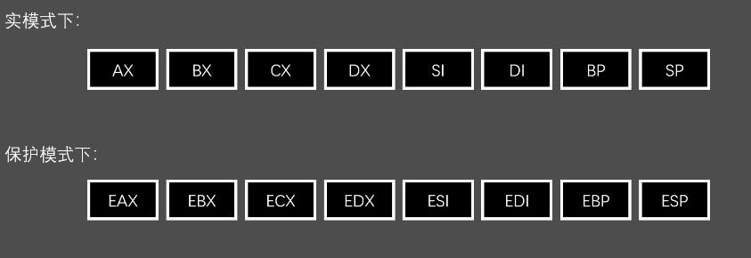
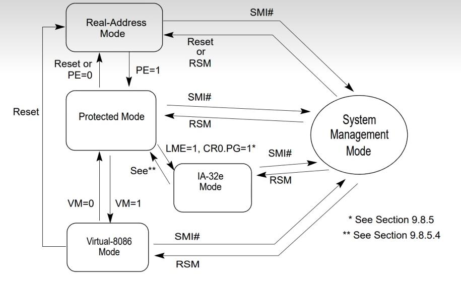

# HandwritingOS
This one is written and learned lunaix OS operating system, from 0 to complete. It will realize environment building, protection mode, interrupt, virtual memory, memory management, multi process &amp; system call, signal, multithreading, PCI and SATA drivers, file system, shell, network, GUI. You are welcome to watch, participate and correct the wrong knowledge（tr：这个一个手写并学习Lunaix OS操作系统，从0到完整，将实现环境搭建，保护模式，中断，虚拟内存，内存管理，多进程&amp;系统调用，信号，多线程，PCI与SATA驱动，文件系统，Shell，网络，GUI，欢迎大家观看和参与和指正不对的知识）

## 项目参考：

1. 深入理解计算机系统（Computer Systems）
2. Modern Operating Systems
3. inter手册
4. [姗姗来迟的系列引入与介绍 - 从零开始自制操作系统 EP-INTRO_哔哩哔哩_bilibili](https://www.bilibili.com/video/BV1zv4y1g7J3?spm_id_from=333.880.my_history.page.click&vd_source=54d88c3531bbb47aa4123072ef9c00aa)

## 项目安排：

1. 环境搭建
2. 引导
3. 保护模式
4. 中断
5. Hello World
6. 虚拟内存
7. 内存管理
8. 多进程&系统调用
9. 信号
10. 多线程
11. PCI与SATA驱动
12. 文件系统
13. Shell
14. 网络
15. GUI

## 保护模式：

保护模式（protected Mode，又称PMode），是x86系列**CPU的一种运行模式**。

x86系列CPU有五种模式：**实模式（16位），保护模式（32位），IA-32e模式**，SMM（系统管理模式），虚拟8086模式。

因为x86是inter第一个32位的CPU，所以我们叫x86为32位cpu

### 在保护模式下面，可以：

- 使用更大的32位寄存器
- 使用更多的内存，多达4GB（如果目标机器安装了足够的RAM的话）
  - 2^32*1024^-3=4
- **能够执行C语言编译过来的机器码！（我们真正的目的）**

### 有得必有失：

- **不能**使用BIOS提供给我们得例程（各种int 中断号）
- **不能**访问磁盘，读取内存大小，从屏幕上显示文字，等等需要通过BIOS中断使用得功能
- 没有系统调用，没有标准库，没有异常捕获，什么都没有。一切要自己造轮子。
- CPU变得更加脆弱，哪怕就是一个轻微得bug（比如1/0这类运算），都可能直接导致==TrIpleFault==（电脑宕机）

### 保护模式下的寄存器：

- 前面都追加了一个“E”作为前缀
- 但并不是所有得寄存器都是这样！
- 段寄存器：CS,ES,DS,SS 依然维持原样，并且大小也维持在16位

#### 为什么还是段寄存器16位？

### 保护模式如何保护：

**保护模式主要是对内存区域的保护**

​	从而保障了进程（的专属内存空间）之间的安全。

**保护模式允许我们：**

- 对内存进行分区。
- 对每个分区进行单独的配置。
- 比如权限，功能，等等其他一推属性

**保护模式就是绘制一幅内存地图---更高的自由度**

CPU会照着这份内存地图来按照我们的规则去控制内存的访问，从而起到保护作用。

- 一般而言，这份地图包括：
- 内存中已经被**划分的区域的位置**
- 每个区域的**种类**
- 每个区域的**权限**

为了方便CPU的管理，我们的需要位每个区域进行登记，比如登记在一个表格里。

CPU管理：通过查表快速了解，管理的区域在哪里？这个区域是做什么的？谁可以访问？

用计算机的话来讲：

这些**区域**我们叫做**段（Segment）**

用来等级的**表格**叫做**全局描述符表（Global Descriptor Table，GDT）**

### 怎么进入保护模式：

图片来源：inter@64 and IA-32 Archite....

这是一幅关于各个**CPU模式之间的状态转移图**。

包括五大模式

重点关注实地址模式（real address model）到保护模式（pModel）的转换就好了

==PE=1==		只要将CR0寄存器中的PE标志位设置拉高，便可以进入保护模式

PE标志位在第一位，我们只需要将CRO的东西喝0x00000001进行与运算，然后把结果写回CR0。

